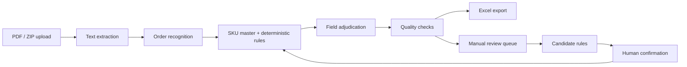

# AI OrderOps Workbench

**AI OrderOps Workbench 在线演示：** https://ai-orderops-workbench.chenxifang529.chatgpt.site  
**AI OrderOps Workbench GitHub 项目：** https://github.com/CXF506837/CXF1

AI OrderOps Workbench is a sanitized portfolio demo for a Codex-assisted order processing system.
It turns order PDFs and ZIP batches into traceable Excel outputs while separating automatic release,
manual review, field quality checks, and rule learning.

This repository is not the client delivery repository. It contains only synthetic data and is safe
to use in a private GitHub portfolio or a personal case-study page.

## Recruiter Quick Start

This portfolio now has two recruiter-facing demo modes:

| Mode | Link / Access | What it proves |
| --- | --- | --- |
| 安全公开版 | https://ai-orderops-workbench.chenxifang529.chatgpt.site | Recruiters can quickly inspect the product flow, quality board, review queue, rule learning, and export preview without setup. |
| 真实可操作版 | Run `scripts\start-live-recruiter-demo.cmd` on your computer, then share the temporary tunnel URL and password. | Recruiters can trigger the real FastAPI backend, upload sanitized PDF/ZIP files, generate a real `.xlsx`, and download it. |

The public demo is designed for fast review without local setup:

1. Open the online demo link above.
2. Click **生成脱敏演示任务**.
3. Review the task detail page, quality board, manual review queue, rule-learning page, and export preview.

The online demo runs on synthetic data and does not require an API key, backend server, or file upload.
It is intentionally not a production order-processing endpoint; the full local version below keeps the
Next.js frontend, FastAPI backend, Docker Compose setup, tests, and sample data for technical review.

## Evidence Metrics

The demo includes an evidence page at `/evidence`. These numbers are synthetic portfolio proof points,
not customer performance claims:

| Metric | Meaning |
| --- | --- |
| 120 条合成订单行 | Synthetic order rows used for portfolio storytelling and regression examples. |
| 600+ 字段裁决 | Field-level decisions across SKU, quantity, engraving, bag color, font, address, and exception handling. |
| 2 种演示形态 | Safe public demo plus real local-backend demo. |
| 4 类质量证据 | Frontend contract test, Next.js build, backend unittest, and repository safety scan. |

The real local demo has also been smoke-tested through the same-origin `/api/live` proxy by calling
`POST /api/live/demo` and receiving a backend-generated job ID.

## Why This Project Exists

Order PDFs often mix shipping blocks, SKU data, product options, fonts, gift-bag colors,
personalization text, and customer notes in one document. A model-only workflow can look fast,
but it can also create hard-to-audit mistakes.

This demo shows a more production-minded workflow:

- deterministic parsing and rule checks first
- optional model assistance for structured review
- field-level evidence for every released value
- manual review for uncertain values
- human corrections converted into pending candidate rules

## Product Capabilities

| Area | What the demo shows |
| --- | --- |
| Intake | Single PDF, ZIP batch, or built-in synthetic demo job |
| Extraction | PDF text parsing with synthetic fallback data for local demos |
| Rule engine | SKU master matching, personalization parsing, font and bag-color extraction |
| Quality control | Question marks, risky fields, and field issues are separated from clean rows |
| Traceability | Each released value keeps a source record: PDF, SKU master, rule, or review |
| Review loop | Manual corrections are recorded without silently mutating historical jobs |
| Rule learning | Candidate rules remain pending until a human confirms them |
| Export | Excel workbook output with order rows, trace records, issues, rules, and summary |

## Architecture



## Tech Stack

- Frontend: Next.js, TypeScript, Tailwind CSS
- Backend: FastAPI, Python
- Storage: local files plus SQLite summary index
- PDF parsing: pdfplumber when available, text fallback for synthetic demo inputs
- Excel generation: openpyxl
- Deployment: Docker Compose

## Local Demo

```bash
cp .env.example .env
docker compose up --build
```

Open:

- Frontend: <http://localhost:3000>
- Backend health: <http://localhost:8000/api/health>

The first screen can generate a synthetic demo task. No customer files are required.

## Windows Preview

```bat
scripts\start-dev-windows.cmd
```

Open:

- Frontend: <http://127.0.0.1:3000>
- Backend health: <http://127.0.0.1:8000/api/health>

Stop services:

```bat
scripts\stop-dev-windows.cmd
```

## Live Recruiter Demo

If you want recruiters to operate a real backend flow instead of only viewing the static portfolio demo,
run the local live demo on your own computer:

```bat
scripts\start-live-recruiter-demo.cmd
```

Open:

- Frontend: <http://127.0.0.1:3000>
- Backend health: <http://127.0.0.1:8000/api/health>
- Default password: `demo-pass`

The frontend uses `/api/live` as a same-origin proxy to the FastAPI backend, so a public tunnel only
needs to expose the frontend port `3000`. See `docs/live-recruiter-demo.md` for the full sharing and
safety checklist.

## Verification

Backend tests:

```bash
cd backend
python -m unittest discover tests
```

Frontend build:

```bash
cd frontend
pnpm install --frozen-lockfile
pnpm build
```

Repository safety scan:

```bash
python scripts/check_repository_safety.py
```

## Demo Quality Contract

The demo intentionally includes a question-mark recipient (`Daddy K??`) to show the review policy.
The system does not guess this value. It keeps the field in the manual review queue while allowing
clean, traceable fields to continue through the export workflow.

The synthetic regression suite also checks that numbered message fragments such as
`1) engraving 3) Grey bag` do not leave numbering artifacts in the engraving field.

## Data Safety

This repository must not contain:

- real customer PDFs
- real output spreadsheets
- real SKU or rule sheets
- API keys
- customer names, addresses, or messages
- client brand names

Generated files are stored under `storage/`, which is ignored by Git.

## Portfolio Usage

For a personal website, show:

- the architecture diagram
- screenshots from the synthetic demo
- quality metrics generated from sample data
- the deterministic-rule + manual-review + candidate-rule loop

Do not publish real customer data, real business rules, or real output tables.

## GitHub Upload

See `docs/github-upload.md`. Keep the repository private unless the contents are reviewed again for
public release.
