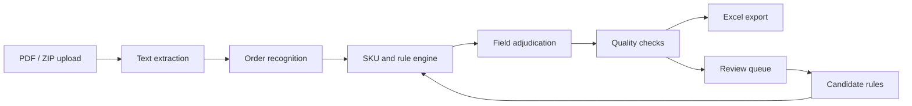

# Architecture

`AI OrderOps Workbench` is a sanitized portfolio demo of an AI-assisted order processing system.

The demo deliberately separates deterministic evidence from AI assistance. A field is released only when it has a traceable source from PDF text, SKU master data, or a confirmed rule. Uncertain fields are routed to review.

